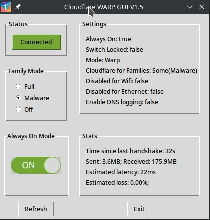
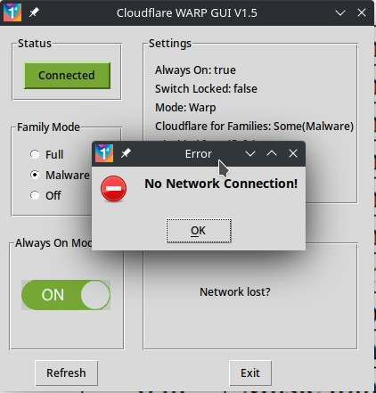

# warp-cli-gui

GUI app to read settings and stats for Cloudflare WARP CLI for Linux, and change some of those settings via the CLI.

## Description

This is a Python GUI program that will interact with the Linux command line to check status, and change basic settings, for Cloudflare WARP CLI. The program does not store any data of its own, nor does it interfere or monitor the VPN in any way.

When started the program will check all warp-cli status and settings, and display in the frames. Auto-updating of the stats will happen automatically every 2 seconds while warp-cli is connected. To prevent overtaxing system resources the program is not doing a full scan of everything, so if changes are made manually at the command line while it is running then press the refresh button to refresh the settings as well in the program. Changes made within the program will update everything accordingly though.

While the program is refreshing stats it will check for WARP being disconnected, or the network disconnecting, and display relevant warnings.

## Requirements and Execution
- Linux OS (tested on Manjaro Linux but should work on other distros).
- warp-svc running as a system daemon by the user executing either 'sudo systemctl start warp-svc' for once off, or 'sudo systemctl enable warp-svc' for boot time activation (should have been installed with warp-cli).
- warp-cli for Linux installed, and the once-off registration done by the user running 'warp-cli register' (instructions at https://developers.cloudflare.com/warp-client/get-started/linux)
- Two options to run this app:
  - Python 3 with pillow library, already installed: Copy the [warp-cli-gui.py, warp_logo.png, off.png, off.png] source files into a single folder, and execute with 'python warp-cli-gui.py'. For ease of use you can add this command, and the working directory, to a new menu item on Linux.
  - As a Linux binary executable (no Python required): Download the binary release files from Github into any directory location on your computer, ensure the warp-cli-gui file has execute permissions, then execute with './warp-cli-gui' from that directory.

## Functionality
- Status button toggles connect / disconnect from WARP
- Family mode can be toggled between Full, Malware, Off
- Always On status can be toggled
- Current WARP settings displayed, and refreshed if changed (or press refresh button)
- Current WARP stats displayed and will refresh automatically every 2 seconds

## Todo's on the Road Map
- Option to switch WARP modes
- Maybe graphs where relevant eg. latency
- Can it show connect status on panel when minimized (Qt can)?

## Video
See my video about the initial creation of this app at https://youtu.be/hhPhiV0o5us.

## Versions
- V0.1 29 Dec 2021 Initial commit. Basically functional but needs connect button to be activated.
- V0.2 Connect/Disconnect button working, Top frames and status button better aligned, connect status not reliable yet though
- V0.3 Connect/Disconnect button status is finally stable through IF condition testing more rigorously for alternatives being returned from status command
- V0.4 30 Dec 2021 Fixed size window, with fixed size frames and spacing
- V0.5 31 Dec 2021 Cloudflare Warp logo added, connect status button colours changed (thanks to my wife Chantel for helping with this), family mode radio button defaults to existing setting, stats auto refresh every 2 secs after Refresh button pressed
- V1.0 31 Dec 2021 First stable version with just README file updated. Binary for Linux added as a release.
- V1.1 1 Jan 2022 Tidied up button press color, optimized some code, added Always On toggle setting
- V1.2 2 Jan 2022 Removed border around toggle button, auto-refresh of stats every 2 secs when connected, optimized function naming, checks lost network connection

## License
This software is available under the GPL-3.0. You should have received a copy of the GNU General Public License along with this program.  If not, see <http://www.gnu.org/licenses/> for more info.